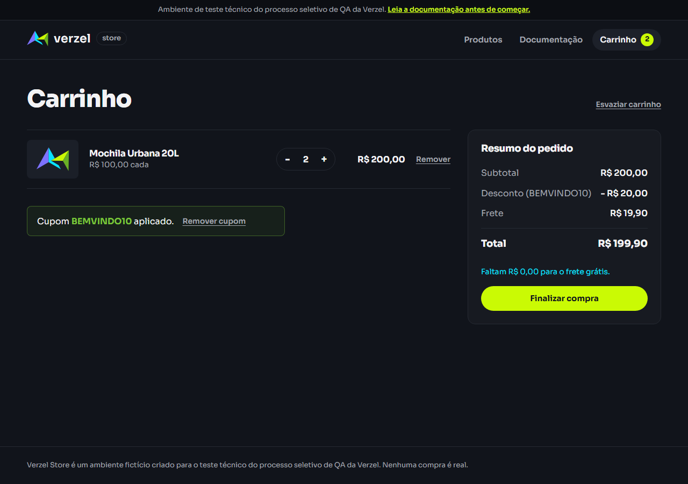

# Evidências da execução

Todas as evidências ficam em [/evidencias](../evidencias/) e são referenciadas cenário a cenário em [execucao.md](execucao.md) e bug a bug em [bugs.md](bugs.md).

| Pasta | Conteúdo | Nome dos arquivos |
|---|---|---|
| [evidencias/ui/](../evidencias/ui/) | Prints de página inteira da loja (PNG) + [resultados.json](../evidencias/ui/resultados.json) com os valores lidos da tela em cada cenário | `<ID do cenário>[-variação].png` |
| [evidencias/api/](../evidencias/api/) | Um JSON por chamada, com método, URL, corpo enviado, status, content-type e corpo recebido | `<ID do cenário>[-variação].json` |
| [evidencias/automacao/](../evidencias/automacao/) | Relatório HTML da automação Playwright (abrir com `npm run report`) | gerado por `npm test` |

> **Sobre os anexos do relatório:** os arquivos em `evidencias/automacao/relatorio/data/` são anexos (prints, traces e contexto de erro) dos testes marcados com `test.fail()`. Eles registram **falhas esperadas**, que reproduzem o BUG-01 e o BUG-02, e não falhas da suíte. No relatório, esses testes aparecem como aprovados.

## Evidências por bug

| Bug | Principais evidências |
|---|---|
| [BUG-01](bugs.md#bug-01) |  [CT-FRE-03.png](../evidencias/ui/CT-FRE-03.png) · [CT-CHK-06-confirmado.png](../evidencias/ui/CT-CHK-06-confirmado.png) · [CT-API-08-b.json](../evidencias/api/CT-API-08-b.json) · [CT-API-18.json](../evidencias/api/CT-API-18.json) |
| [BUG-02](bugs.md#bug-02) | [CT-API-11-q6.json](../evidencias/api/CT-API-11-q6.json) · [CT-API-17.json](../evidencias/api/CT-API-17.json) · [CT-API-30-b.json](../evidencias/api/CT-API-30-b.json) · [CT-QTD-07-carrinho.png](../evidencias/ui/CT-QTD-07-carrinho.png) · [CT-QTD-07-confirmado.png](../evidencias/ui/CT-QTD-07-confirmado.png) |
| [BUG-03](bugs.md#bug-03) | [CT-API-05.json](../evidencias/api/CT-API-05.json) |
| [BUG-04](bugs.md#bug-04) | [CT-API-12-d.json](../evidencias/api/CT-API-12-d.json) |

## Como regerar
```bash
node scripts/executar-api.mjs   # evidências de API
node scripts/executar-ui.mjs    # prints da interface
# Para rodar só alguns cenários, passe uma expressão regular com os IDs (o resultado é mesclado):
node scripts/executar-ui.mjs "CT-QTD-07|EXP-06"
```
Os números de pedido (VZ-…) mudam a cada execução, porque são fictícios e gerados na hora.
